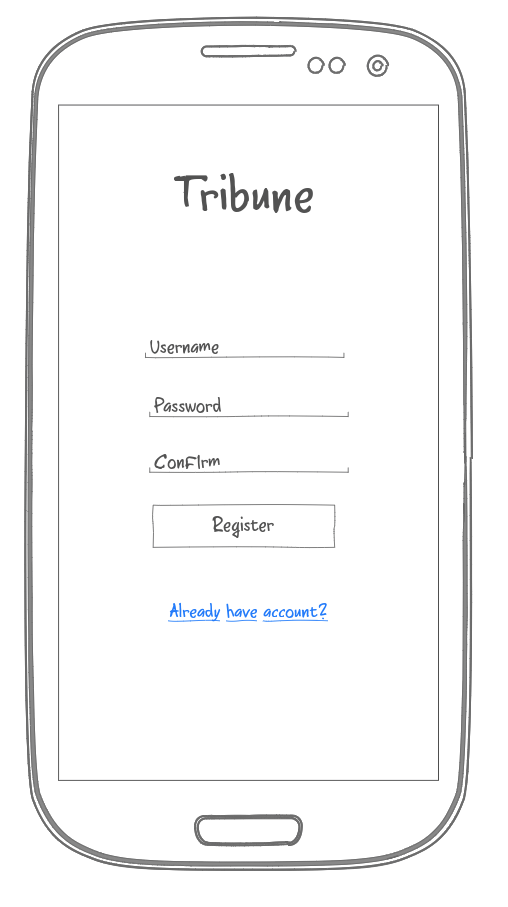
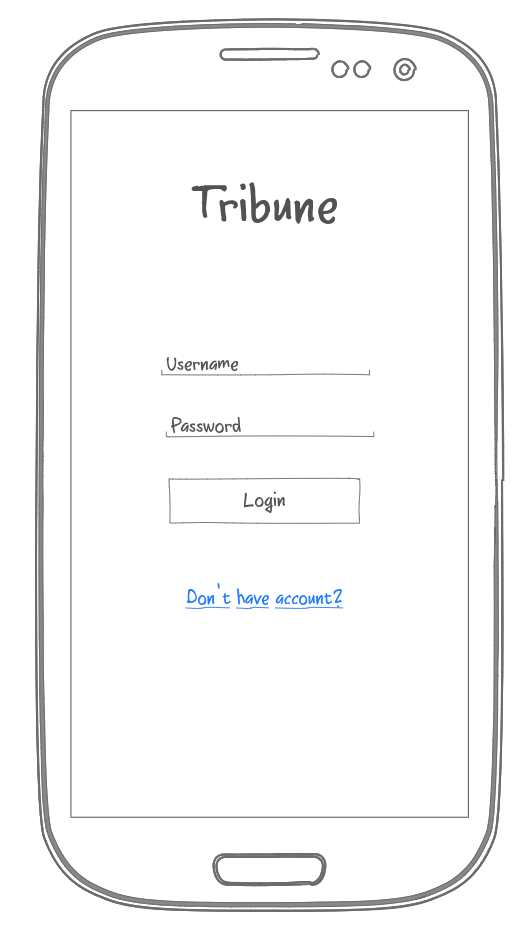
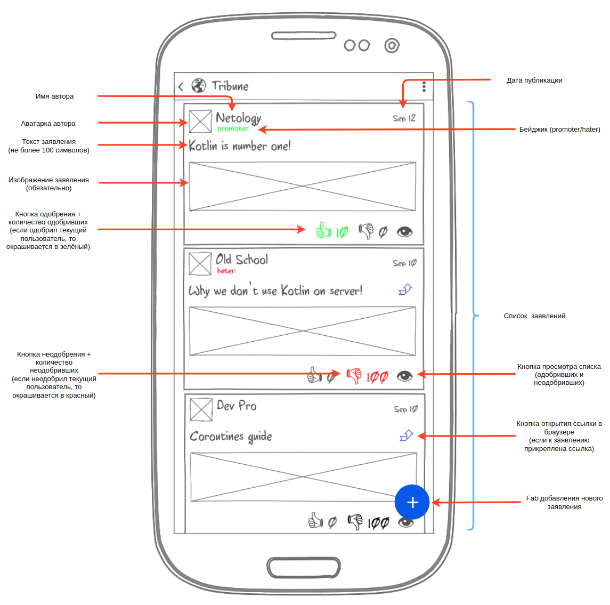
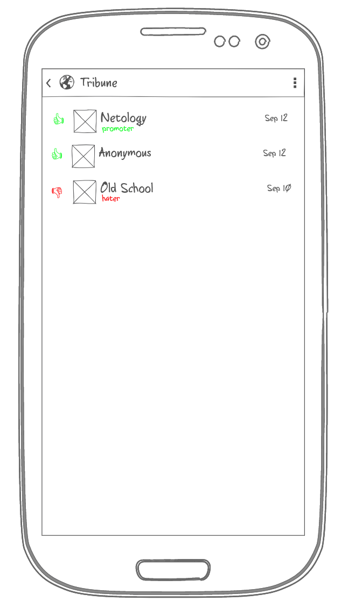

Basic Kotlin. Tribune
---

###### tags: `netology` `bkt`

## Легенда

Вам предстоит разработать сервис социального микроблоггинга Tribune, позволяющий любому зарегистрированному пользователю высказать свои идеи и получить одобрение (либо неодобрение) со стороны сообщества.

## Основная концепция

Ключевая идея - создать приложение и backend для него, который позволяет публиковать собственные идеи или заявления.

Важная составляющая этого сервиса - социализация, если человек публикует идеи, неодобряемые сообществом, то рано или поздно может перейти в режим "только чтения" (режим с ограниченными правами, позволяющий только просматривать идеи, одобрять/неодобрять их).

## Прототипы

В качестве прототипов для реализации мы предлагаем вам следующие (это всего лишь эскизы - не нужно пытаться реализовывать подобный дизайн, пользуйтесь стандартными виджетами).

### Экран регистрации

Желательно, чтобы после регистрации человек мог сразу пользоваться приложением, без необходимости заново логиниться:

### Экран входа

### Экран идей (картинка кликабельна)

Все идеи отсортированы по дате.

У каждой идеи есть:
1. Автор
1. Дата публикации
1. Текст (обязательно, максимальное количество символов - не более 100)
1. Изображение (обязательно)
1. Ссылка (опционально)

Экран идей должен пролистываться вниз (с подгрузкой более старых идей - по 20 шт.) + pull to refresh для получения новых.

Кликабельные элементы:
1. Автор - при клике на авторе происходит переход на страницу с точно таким же списком, но только с идеями этого автора (соответственно, это должно фильтроваться на сервере и с сервера приходить список только с этими авторами)
2. Кнопка одобрить (палец вверх)* - при клике отправляется одобрение текущего пользователя для соответствующей идеи. Пока пользователь не кликнул - иконка не окрашена (см. 3 карточку) после клика - окрашивается в зелёный цвет. Кликать можно только один раз - при повторных кликах нужно выводить Toast с сообщением "You can vote only once!". "Снимать" голос нельзя.
3. Кнопка не одобрить (палец вниз)* - при клике отправляется неодобрение текущего пользователя для соответствующей идеи. Пока пользователь не кликнул - иконка не окрашена (см. 3 карточку) после клика - окрашивается в красный цвет. Кликать можно только один раз - при повторных кликах нужно выводить Toast с сообщением "You can vote only once!". "Снимать" голос нельзя.
4. Кнопка просмотра голосов (глаз) - при клике открывается экран списка одобривших и не одобривших (см.следующий раздел).

Важно: пользователь может либо одобрить, либо не одобрить.

### Список одобривших/не одобривших

Все голоса отсортированы по дате.

Экран проголосовавших должен пролистываться сверху вниз (ленивой подгрузки не нужно).

Pull to refresh используется для обновления экрана.

При нажатии на кнопку назад должен быть возврат к экрану с идеями.

При нажатии на конкретную строку должен открываться экран со списками идей только этого пользователя.

### Экран добавления идеи и экран профиля

Эти экраны мы оставляем целиком на ваше усмотрение.

Ключевое требование: в профиль (для аватарки) и в идею (для картинки) можно загружать изображение.

### Режим Read Only

Пользователь переходит в режим Read Only (не может создавать новые идеи, а может только голосовать за существующие), если одна из его идей ушла в минус 100 (для тестов можете сократить это количество, допустим, до 5), при количестве одобрений 0.

Если же хоть одно одобрение появилось, пользователь должен выйти из режима Read Only.

Допускается задержка с выходом из этого режима (т.е. если пользователь вышел из режима Read Only - нормально, если приложение разблокирует функции добавления идей только при следующем обновлении списка или старте приложения).

### Бейджики (необязательная фича)

Реализация этой фичи не обязательна и не влияет на получение итоговой оценки по диплому.

Нужно вести статистику одобрений/неодобрений.

Пользователю присваивается рейтинг `hater`, если:
1. Количество выставленных им (им, а не его идеям) неодобрений больше 100
1. Количество неодобрений превышает количество одобрений более чем в два раза
1. Пользователь входит в ТОП-5 пользователей, поставивших наибольшее количество неодобрений

Пользователю присваивается рейтинг `promoter`, если:
1. Количество выставленных им (им, а не его идеям) одобрений больше 100
1. Количество одобрений превышает количество неодобрений более чем в два раза
1. Пользователь входит в ТОП-5 пользователей, поставивших наибольшее количество одобрений

Обратите внимание: что статистика может быть неточной (в противном случае, вам достаточно тяжело будет разрулить всё с concurrency, либо переносить локи на уровень сервиса).

### Push Notifications

Нужно уведомлять пользователя пушами о выставлении одобрение/неодобрение его посту:
1. Автор (кто выставил)
1. Одобрил и не одобрил

## Архитектура

Поскольку вы - автор системы и ключевой её архитектор, вам предстоит самостоятельно решить, как организовать структуру кода как на клиентской, так и на серверной стороне.

Обратите внимание, Heroku:
* будет останавливать ваше приложение (все данные, хранящиеся в памяти сотрутся)
* будет удалять все ваши файлы, которые не хранятся в Git (при остановке вашего приложения)

Поэтому несколько советов:
* чтобы каталог хранился в Git (и его не приходилось создавать средствами Kotlin) поместите в каталог пустой файл .gitkeep
* захардкодьте часть демо-данных (файлы и данные в памяти), чтобы было удобно проверять и не приходилось каждый раз загружать файлы

По организации серверной части мы не требуем от вас ничего, сверх того, что проходили на лекциях (этого должно быть достаточно для реализации всех функций):
* хранение данных в памяти
* REST API
* токены (с бесконечным сроком действия)

Не думайте о проблемах, связанных с хранением данных в памяти сервера (о том, что там может храниться слишком много данных и т.д.).

## Требования к оформлению

### Визуальное оформление

Мы никак не ограничиваем вас с точки зрения визуального оформления, но помните, что хорошо бы, чтобы человек, уже знакомый с Android, мог без труда пользоваться вашим приложением.

### Техническое оформление

Всё должно быть оформлено в виде публичных репозиториев на GitHub (один - для Android-приложения, второй - для серверной части).
